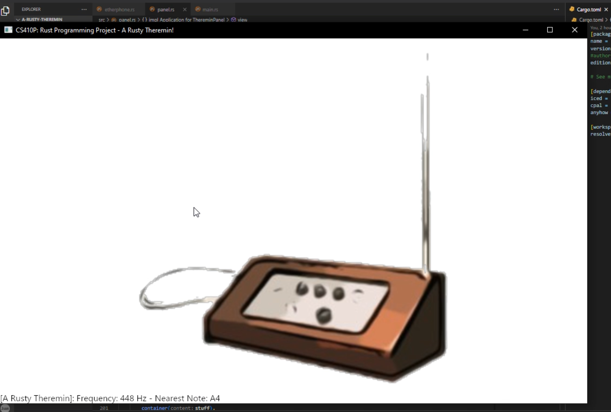
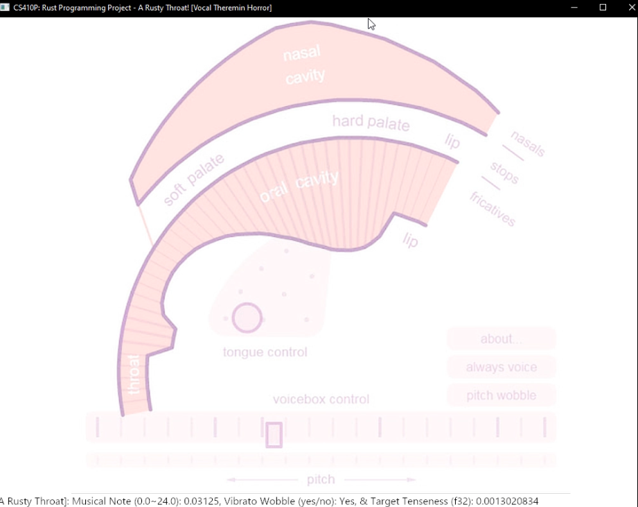

# *A Rusty Musicbox* Project

# CS 410P: Rust Programming, Course Project - A Rusty Musicbox - Fall 2023

## by Dan Jang

### Project Description

TBA

### Project Layout

1. ***`A Rusty Musicbox`*** (*a-rusty-musicbox*): Main Wrapper / Binary CLI Program Library
   1. ***`A Rusty Theremin`*** (*a-rusty-theremin*): A Complex, Rusty Theremin Musical Instrument Implementation Library

      
   2. ***`A Rusty Throat`*** (*a-rusty-throat*): A Silly, Rusty Throat/Vocal Cord Simulation Musical Library

      

***~~`A Rusty Piano`~~*** (*~~a-rusty-piano~~*): ~~A Simple, Rusty Piano Musical Instrument Implementation Library~~

### Project Examples

TBA

### Project Procedures, Challenges, & Analysis

TBA

### Project References & Credits

* [Theremin](https://en.wikipedia.org/wiki/Theremin)
* *[Public Domain Photo of a Theremin](http://www.publicdomainfiles.com/show_file.php?id=13533906018538)*
* The *[iced](https://docs.rs/iced/0.10.0/iced/)* crate for main GUI!
* The *[cpal](https://docs.rs/crate/cpal/latest/features)* crate for low-level, cross-platform audio I/O!
* The spooky, *[atomic](https://doc.rust-lang.org/std/sync/atomic/)* types - for maximum audio smoothness, I think!
* The *[Tiger.svg example](https://github.com/iced-rs/iced/tree/master/examples/svg)* from the iced crate *GitHub*!
* ~~The *[piano-rs](https://github.com/ritiek/piano-rs)* crate!~~
* The ***[Pink Trombone](https://crates.io/crates/pink-trombone)*** crate - originally authored by *[Neil Thapen](https://users.math.cas.cz/~thapen/)* in 2017!
  * [Example](https://github.com/lostmsu/pink-trombone/blob/HEAD/examples/pink-trombone.rs) for linkage to an external audio library, e.g. *[rodio](https://github.com/RustAudio/rodio)*!
* The background photo for *`a-rusty-throat`* was from *[Experiments from Google: Pink Trombone](https://experiments.withgoogle.com/pink-trombone)*!
* The *[prompted](https://lib.rs/crates/prompted)* crate authored by Professor Bart in 2017!
* Because I am a goofball, needed to remind myself how [Cargo manifests are structured](https://stackoverflow.com/questions/57756927/rust-modules-confusion-when-there-is-main-rs-and-lib-rs) ([also](https://users.rust-lang.org/t/main-rs-and-lib-rs-at-same-level/42499)).

## License: *[MIT License](https://opensource.org/license/mit//)* [LICENSE] (as of December 5th, 2023)
