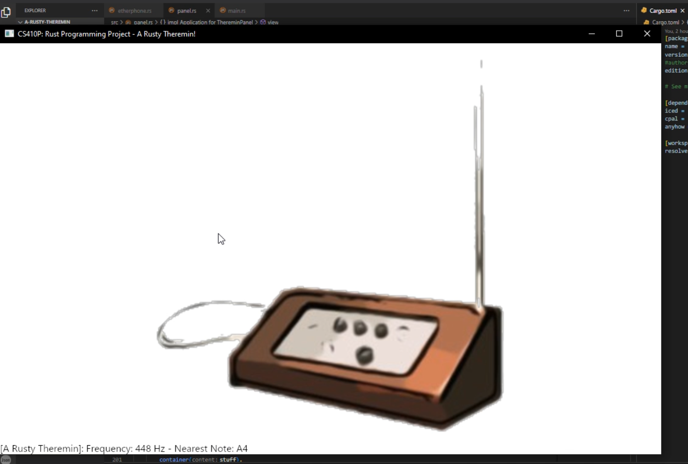
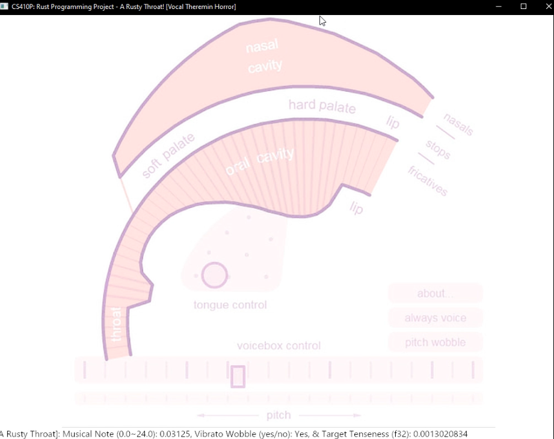

# *A Rusty Musicbox* Project

# CS 410P: Rust Programming, Course Project - A Rusty Musicbox - Fall 2023

## by Dan Jang

### Project Layout

1. ***`A Rusty Musicbox`*** (*a-rusty-musicbox*): Main Wrapper / Binary CLI Program Library
   1. ***`A Rusty Theremin`*** (*a-rusty-theremin*): A Complex, Rusty Theremin Musical Instrument Implementation Library
   2. ***`A Rusty Throat`*** (*a-rusty-throat*): A Silly, Rusty Throat/Vocal Cord Simulation Musical Library

### Project Build & Run Instructions

* To get started, use Git to clone the project repository, e.g. typing this in your console / PowerShell / Vim / emacs / VSCode, etc:

```
git clone https://github.com/DebuggerDan/a-rusty-musicbox.git
```

* After the repository has been cloned successfully, navigate to the cloned repository directory.
* While inside the root directory (inside the a-rusty-musicbox folder, where there should be a Cargo.toml file inside)  simply build-run the Rust project normally to experience the wacky & silly instruments that await:

  ```
  cargo run
  ```
* The project should display a command-line interface, where you can enter a whole number between 1 to 3 to select from the given options - entering a 1 will open A Rusty Theremin & entering a 2 will open A Rusty Throat - and entering a 3 will close the program.
* Do note: Please make sure to adjust your device/system volume before proceeding to open either of the instruments, as live playback libraries do tend to blast at full volume. To hopefully mitigate accidental blasts, at least, the first instrument, the Theremin, has been set with a default, low frequency of 127 Hz - just in case - instead of the awful, screech-like 440 Hz default that programmers for some unknown reason like to usually set. But, the second instrument may simply just be horrifying, just of its vocal warblings, it is a virtualized speech synthesizer after all - you have been warned.
* Also: After either instrument is ran, the program will exit to reset, as live playback tends to become super laggy or crash anyways after each 'go-around.' Perhaps with more time, this can be mitigated.

### Project Description

   This project,*A Rusty Musicbox*, is composed of three Rust member-packages in a [Cargo workspace configuration](https://doc.rust-lang.org/book/ch14-03-cargo-workspaces.html). The root package is called `a-rusty-musicbox`, with the two other member-packages each implementing unique musical instruments, called `a-rusty-theremin` and `a-rusty-throat`.

   The root package, a-rusty-musicbox, provides a command-line interface (CLI), where the user can select between the two instruments or exiting the main project program.

   The first musical instrument package,`a-rusty-theremin`, is an virtual implementation of the very interesting & unique [Theremin](https://www.youtube.com/watch?v=K6KbEnGnymk), which was invented by [Leon Theremin](https://en.wikipedia.org/wiki/Theremin) in 1920. My implementation of the theremin through this first instrument-package, is based on a comprehensive, [iced-library](https://docs.rs/iced/0.10.0/iced/index.html) based GUI (panel.rs) that features dynamic event-subscriptions to keep track of user input, which is in the live tracking of the user's mouse cursor inside the GUI instrument window.

   Additionally, with this complex, dynamic event-subscription system, live & immediate normalization of user-input is made possible - specifically, let's say you expand or shrink the GUI window - no problem, as the iced GUI has been designed to automatically update the calculations that are used to best-fit the user's input, based on the GUI window's relative width-and-height aspects and ratios.

   Without boring you, dear reader, this basically ensures that even if the user may have different sizes for the instrument GUI window, the live normalization helps to ensure relatively standardized input patterns so that the 'instrument' can be played regardless of user window-preference or screen sizes.

   Also, statistics are streamed live that display what frequency & closest-approximate musical note that the Theremin may be currently playing at a given spot on the instrument GUI, specifically, the frequency displayed will be given in Hertz & 14 musical frequency-to-note conversion notes provided, e.g. around or below 440 Hz would read near an 'A4' note. Anyways, I think the effort to use the subscription-event features of iced was extremely stressful, but perhaps very slightly worth the coolness.

   The instrument also has the etherphone.rs module, which implements most of the audio device & playback streaming through the cpal library & the main musictime() function in lib.rs for usage outside the package.

   The actual tones are generated & played back in real-time, based on sine-wave generation & the x- and y- dimensions of the user's mouse cursor at a given time. Specifically, moving in the positive y-direction results in a higher pitch / frequency. With a little more time, it would have been nice to add colorful visualizations or add variations via the x-dimensional directions, however.

   The second musical instrument package, a-rusty-throat, is a variation of the Theremin instrument - except, instead of pure, mostly unadulterated sine-waves - the audio is generated through a quirky,[articulatory speech synthesizer library](https://dood.al/pinktrombone/), the [Pink Trombone](https://youtu.be/N1T6HZ4QORM) - first written by [Neil Thapen](https://users.math.cas.cz/~thapen/), in 2017.

  This second musical instrument also features a [iced](https://docs.rs/iced/0.10.0/iced/index.html)-library based GUI (larynx.rs) & has audio device and stream generation through cpal (in vocalcords.rs), but through the [Pink Trombone crate](https://crates.io/crates/pink-trombone), which was ported to Rust from a TypeScript-converted version of the original format.

   The tone generation is also through the user's mouse-cursor movements in the GUI window, but with additional tonal-modularity & control, where in this second instrument, the positive-y direction yields higher pitch/~~eldritch screaming~~, the cursor being in the right-horizontal section of the window enabling voice vibrato, & other wacky control features. Yet, with more time, a feature I'd love to have implemented was the actual visualization ot the vocal system flexing & moving as the speech is generated, but I think that would have taken up quite more time.

### Project Examples





### Project Procedures, Challenges, & Analysis

   Testing, although not much is present in implementation form, was conducted throughout the project - especially during the immense struggles in implementing a mouse-cursor based, live playback control virtual Theremin. I have spent at least 7 hours reading & re-reading the iced GUI library docs, whilst troubleshooting via quick tests ran locally. Manual bug testing was conducted to ensure the project worked well, where after about an hour of testing with a near finalized draft, a re-occurring crashing issue was discovered when looping through the instruments, ergo, a triage solution of having the program simply reset & be re-ran for consequetive instrument demos, unfortunately had to be implemented - although, as mentioned previously, with more time, I think (hopefully) a solution could be found to mitigate crashes.

   What did not work, was my initial thoughts in implementing a piano. There were some very neat, but very fully & standalone examples of pianos already completed as available on crates.io, where, in my initial mental & physical exhaustion following 15 hours of non-stop programming & finishing the first instrument, the Theremin, I thought to simply make a wrapper library for one available piano crate - but with a little bit of curiosity & doom-scrolling on crates.io, I found the Pink Trombone Rust port-crate, so I decided to implement A Rusty Throat as a bio-human flavor of the virtualized Theremin, instead of taking (well, it seemed*easy* at first) alternate route of a piano. I think I chose well, as implementing a piano would kinda be a little bit "meh", already done, whereas a terrifying, Ghost in the Shell esque screeching synth-theremin - I think, is slightly more interesting, if not terrifying.

   There were things I had planned initially, such as the main wrapper library being a colorful GUI panel-based wrapper, instead of the ol' commandline-interface (CLI) as it is currently. Moreover, with more time, I'd have loved to also have audiovisual effects in the instruments, where the pitch & frequency being played is tied with color changes or special, cute effects - specifically, slightly sad not being able to create an actual musicbox GUI panel with the instruments 'inside' the box - alas, I do admit my programming prowess is a little skewed towards theory than the*arts*. Additionally, having the program be able to run consequetive experiences would have been cool & may be a future improvement to explore.

### Project References & Credits

* [Theremin](https://en.wikipedia.org/wiki/Theremin)
* *[Public Domain Photo of a Theremin](http://www.publicdomainfiles.com/show_file.php?id=13533906018538)*
* The *[iced](https://docs.rs/iced/0.10.0/iced/)* crate for main GUI!
* The *[cpal](https://docs.rs/crate/cpal/latest/features)* crate for low-level, cross-platform audio I/O!
* The spooky, *[atomic](https://doc.rust-lang.org/std/sync/atomic/)* types - for maximum audio smoothness, I think!
* The *[Tiger.svg example](https://github.com/iced-rs/iced/tree/master/examples/svg)* from the iced crate *GitHub*!
* The ***[Pink Trombone](https://crates.io/crates/pink-trombone)*** crate - originally authored by *[Neil Thapen](https://users.math.cas.cz/~thapen/)* in 2017!
  * [Example](https://github.com/lostmsu/pink-trombone/blob/HEAD/examples/pink-trombone.rs) for linkage to an external audio library, e.g. *[rodio](https://github.com/RustAudio/rodio)*!
* The background photo for *`a-rusty-throat`* was from *[Experiments from Google: Pink Trombone](https://experiments.withgoogle.com/pink-trombone)*!
* The *[prompted](https://lib.rs/crates/prompted)* crate authored by Professor Bart in 2017!
* Because I am a goofball, needed to remind myself how [Cargo manifests are structured](https://stackoverflow.com/questions/57756927/rust-modules-confusion-when-there-is-main-rs-and-lib-rs) ([also](https://users.rust-lang.org/t/main-rs-and-lib-rs-at-same-level/42499)).
* *[Cargo workspaces](https://doc.rust-lang.org/book/ch14-03-cargo-workspaces.html)*.

## License: *[MIT License](https://opensource.org/license/mit//)* [LICENSE] (as of December 5th, 2023)
